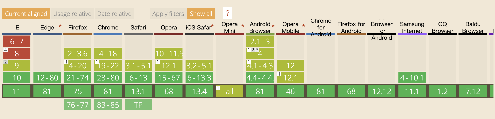

# vue相关讲解
核心：数据驱动的组件系统

数据驱动：数据改变，使用该数据的部分都会改变，也就是说数据是响应式的。这样的好处就是开发只要关注如何操作数据，忽略直接操作dom，忽略数据改变如何影响页面。

组件：vue是单页面应用，结合路由通过更换组件，实现页面‘跳转’。而且组件提高了封装复用性。

[vue官网](https://cn.vuejs.org/v2/guide/)
## 基本使用
特点：配置性、声明性
1. 创建
   
   [链接](./init_demo.html)
2. 组件通信

   [链接](./prop_demo.html)
3. 组件生命周期

   [链接](./life_cycle_demo.html)
## 相关依赖库
vue本身只负责数据驱动部分，但具有拓展性，可以加入插件，其他功能通过第三方库实现。
#### vue-cli
[vue-cli官网](https://cli.vuejs.org/zh/guide/installation.html)

启动vue项目的脚手架，基于webpack，是前端工程化的工具。
#### vue-router
[vue-router官网](https://router.vuejs.org/zh/)
#### vuex
[vuex官网](https://vuex.vuejs.org/zh-cn/)
## 结合jeecg
前端鉴权

1. `router.beforeEach`前置路由导航，对访问路由进行拦截
2. vuex当中请求权限表，整理成路由规则
3. `router.addRoutes`动态添加路由规则

Ant-design-vue

[ant官网](https://www.antdv.com/docs/vue/introduce-cn/)

多语言

vue-i18n
## 兼容性

[文档说明](https://cn.vuejs.org/v2/guide/installation.html#%E5%85%BC%E5%AE%B9%E6%80%A7)
